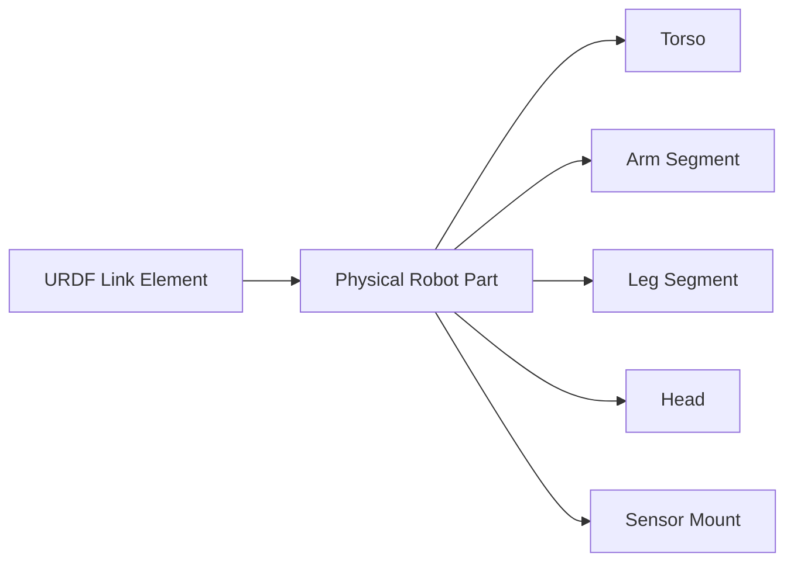
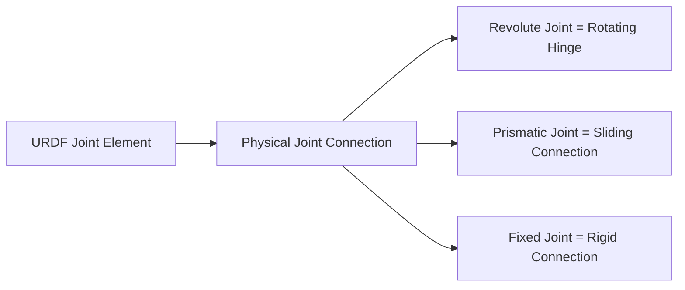

# URDF Diagrams: Mapping Digital to Physical

## Learning Objectives
- Visualize the connection between URDF elements and physical robot components
- Understand how XML structure corresponds to physical robot structure
- Interpret diagrams that show URDF-to-robot mappings
- Recognize the spatial relationships defined in URDF files

## Introduction to URDF-Physical Mapping

URDF serves as the bridge between the digital representation of a robot and its physical counterpart. Understanding this mapping is crucial for effective robot design and control.

## Core Mapping Concepts

### 1. Links Map to Physical Bodies



**Example:**
```xml
<link name="left_upper_arm">
  <visual>
    <geometry>
      <cylinder radius="0.04" length="0.3"/>
    </geometry>
    <material name="grey"/>
  </visual>
</link>
```
**Maps to:** A grey cylindrical physical arm segment that is 30cm long with 8cm diameter

### 2. Joints Map to Physical Connections



**Example:**
```xml
<joint name="elbow_joint" type="revolute">
  <parent link="upper_arm"/>
  <child link="forearm"/>
  <axis xyz="1 0 0"/>
  <limit lower="-1.57" upper="1.57"/>
</joint>
```
**Maps to:** A rotating hinge connection between the upper arm and forearm that can rotate ±90° around the X-axis

## Visual Mapping Diagrams

### Diagram 1: Complete Humanoid Structure

```
                    [head]
                      |
               [neck_joint] (revolute)
                      |
                   [torso]
                    /   \
           [torso_to_left_shoulder]  [torso_to_right_shoulder]
                   |                     |
            [left_shoulder]       [right_shoulder]
                   |                     |
       [left_shoulder_joint]   [right_shoulder_joint]
                   |                     |
           [left_upper_arm]      [right_upper_arm]
                   |                     |
       [left_elbow_joint]      [right_elbow_joint]
                   |                     |
           [left_forearm]        [right_forearm]
                    \                   /
                     [torso_to_hips] (fixed)
                           |
                   [left_hip]  [right_hip]
                        |         |
                [left_hip_joint] [right_hip_joint]
                        |         |
                 [left_thigh] [right_thigh]
                        |         |
               [left_knee_joint] [right_knee_joint]
                        |         |
                 [left_shin]   [right_shin]
                        |         |
              [left_ankle_joint] [right_ankle_joint]
                        |         |
                 [left_foot]   [right_foot]
```

### Diagram 2: Joint Type Mappings

```
Revolute Joint:
  Physical: Rotating hinge (like elbow)
  URDF: type="revolute" with limits
  Movement: Single axis rotation within limits

Continuous Joint:
  Physical: Free rotation (like a wheel hub)
  URDF: type="continuous" (no limits)
  Movement: Continuous rotation on single axis

Prismatic Joint:
  Physical: Linear slider (like a drawer)
  URDF: type="prismatic" with limits
  Movement: Linear motion within limits

Fixed Joint:
  Physical: Rigid connection (like welding)
  URDF: type="fixed"
  Movement: No movement allowed
```

### Diagram 3: Coordinate System Mapping

```
URDF Coordinate System (Right-Hand Rule):
  Z ↑
    |    / Y
    |   /
    |  /
    | /
    O ------> X

Joint Axis Mapping:
  axis xyz="1 0 0" → Rotation around X-axis (forward/back tilt)
  axis xyz="0 1 0" → Rotation around Y-axis (left/right tilt)
  axis xyz="0 0 1" → Rotation around Z-axis (spin)
```

## Detailed Component Mapping Examples

### Example 1: Humanoid Arm

**URDF Definition:**
```xml
<link name="upper_arm">
  <visual>
    <origin xyz="0 0 -0.15"/>
    <geometry>
      <cylinder radius="0.04" length="0.3"/>
    </geometry>
    <material name="grey"/>
  </visual>
</link>

<joint name="shoulder_joint" type="revolute">
  <parent link="torso"/>
  <child link="upper_arm"/>
  <origin xyz="0.2 0 0.4" rpy="0 0 0"/>
  <axis xyz="1 0 0"/>
  <limit lower="-1.57" upper="1.57"/>
</joint>
```

**Physical Mapping:**
```
Physical Robot:              URDF Equivalent:
┌─────────────────┐
│      Torso      │ ←───── parent="torso"
│                 │
│        +        │ ←───── joint location (0.2, 0, 0.4)
│                 │
└─────────────────┘
        │
        │ shoulder_joint (revolute, X-axis rotation)
        │
        ▼
┌─────────────────┐
│                 │
│  Upper Arm      │ ←───── link="upper_arm"
│  (30cm long)    │       geometry: cylinder(0.08m dia, 0.3m length)
│                 │
└─────────────────┘
```

### Example 2: Humanoid Leg

**Physical Structure:**
```
Hip Joint (torso connection)
    │
    ▼
Thigh (upper leg segment)
    │
    ▼
Knee Joint (bending connection)
    │
    ▼
Shin (lower leg segment)
    │
    ▼
Ankle Joint (foot connection)
    │
    ▼
Foot (contact with ground)
```

**URDF Mapping:**
```xml
<!-- Thigh Link -->
<link name="left_thigh">
  <visual>
    <origin xyz="0 0 -0.25"/>
    <geometry>
      <cylinder radius="0.05" length="0.5"/>
    </geometry>
  </visual>
</link>

<!-- Knee Joint -->
<joint name="left_knee_joint" type="revolute">
  <parent link="left_thigh"/>
  <child link="left_shin"/>
  <origin xyz="0 0 -0.5"/>
  <axis xyz="1 0 0"/>
  <limit lower="0" upper="1.57"/>
</joint>
```

## Spatial Relationship Diagrams

### Origin Mapping
```
URDF Origin: <origin xyz="0.2 0 0.4" rpy="0 0 0"/>
            ↓
Physical:   Position (0.2m right, 0m forward, 0.4m up)
            from parent link's center
            with no rotation
```

### Frame Transformations
```
Parent Link Frame:
Origin at center of parent link

Child Link Frame:
Positioned by joint's origin element
Orientation by joint's rpy (roll, pitch, yaw) values

Example:
<origin xyz="0.1 0 0" rpy="0 0.5 0"/>
Means: 10cm forward from parent, rotated 28.6° in pitch
```

## Validation Diagrams

### Correct Kinematic Chain:
```
base_link → torso → head ✓
           → arms → hands ✓
           → legs → feet ✓
```

### Incorrect Kinematic Chain:
```
base_link → torso → head ✓
           → arms → hands ✓
                    → extra_part (no joint connection) ✗
```

## Common Mapping Pitfalls

### Pitfall 1: Coordinate Confusion
```
Wrong: Thinking URDF coordinates match robot's "forward" direction
Right: URDF uses standard coordinate system regardless of robot orientation
```

### Pitfall 2: Scale Misunderstanding
```
Wrong: Using centimeters or inches in URDF
Right: All URDF measurements are in meters
```

### Pitfall 3: Joint Direction Confusion
```
Wrong: Assuming joint direction is intuitive
Right: Always check the axis element (xyz values) to know rotation direction
```

## Independent Validation

After studying these diagrams, you should be able to:

1. Look at a URDF file and visualize the physical robot structure
2. Understand how each link and joint corresponds to a physical component
3. Predict how changes to URDF elements will affect the physical robot
4. Identify potential issues in the URDF-physical mapping

## Practice Exercise

Given the following URDF snippet, draw the physical structure it represents:

```xml
<link name="robot_base">
  <visual>
    <geometry><cylinder radius="0.1" length="0.2"/></geometry>
  </visual>
</link>

<link name="sensor_mount">
  <visual>
    <geometry><box size="0.05 0.05 0.02"/></geometry>
  </visual>
</link>

<joint name="base_to_sensor" type="fixed">
  <parent link="robot_base"/>
  <child link="sensor_mount"/>
  <origin xyz="0 0 0.15"/>
</joint>
```

**Answer:** A cylindrical base with a small box-shaped sensor mount positioned 15cm above the base, rigidly attached (fixed joint).

## Next Steps

Understanding these mappings is crucial for modifying URDF files effectively. In the next section, we'll apply this knowledge to practical exercises for modifying URDF files.